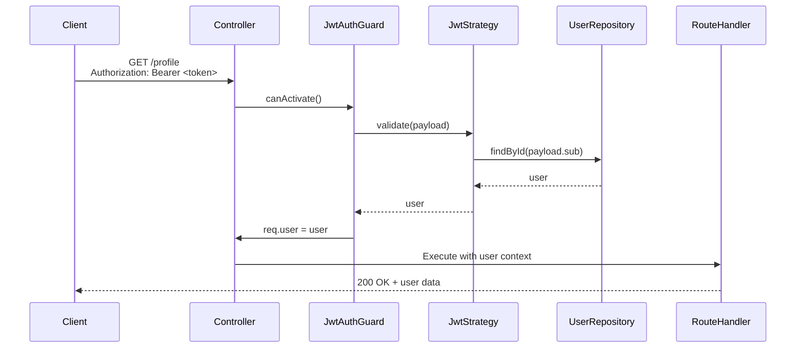

```mermaid
sequenceDiagram
    participant Client
    participant Controller
    participant JwtAuthGuard
    participant JwtStrategy
    participant UserRepository
    participant RouteHandler

    Client->>Controller: GET /profile<br/>Authorization: Bearer <token>
    Controller->>JwtAuthGuard: canActivate()
    JwtAuthGuard->>JwtStrategy: validate(payload)
    JwtStrategy->>UserRepository: findById(payload.sub)
    UserRepository-->>JwtStrategy: user
    JwtStrategy-->>JwtAuthGuard: user
    JwtAuthGuard->>Controller: req.user = user
    Controller->>RouteHandler: Execute with user context
    RouteHandler-->>Client: 200 OK + user data
```

