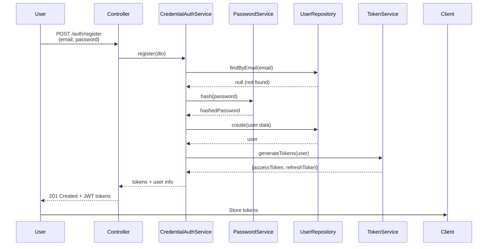

```mermaid
sequenceDiagram
    participant User
    participant Controller
    participant CredentialAuthService
    participant PasswordService
    participant UserRepository
    participant TokenService
    participant Client

    User->>Controller: POST /auth/register<br/>{email, password}
    Controller->>CredentialAuthService: register(dto)
    CredentialAuthService->>UserRepository: findByEmail(email)
    UserRepository-->>CredentialAuthService: null (not found)
    CredentialAuthService->>PasswordService: hash(password)
    PasswordService-->>CredentialAuthService: hashedPassword
    CredentialAuthService->>UserRepository: create(user data)
    UserRepository-->>CredentialAuthService: user
    CredentialAuthService->>TokenService: generateTokens(user)
    TokenService-->>CredentialAuthService: {accessToken, refreshToken}
    CredentialAuthService-->>Controller: tokens + user info
    Controller-->>User: 201 Created + JWT tokens
    User->>Client: Store tokens
```

